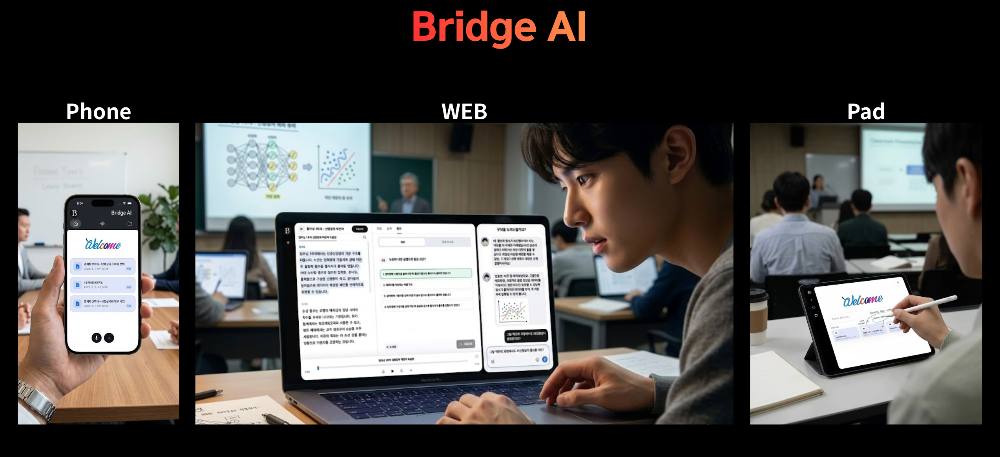
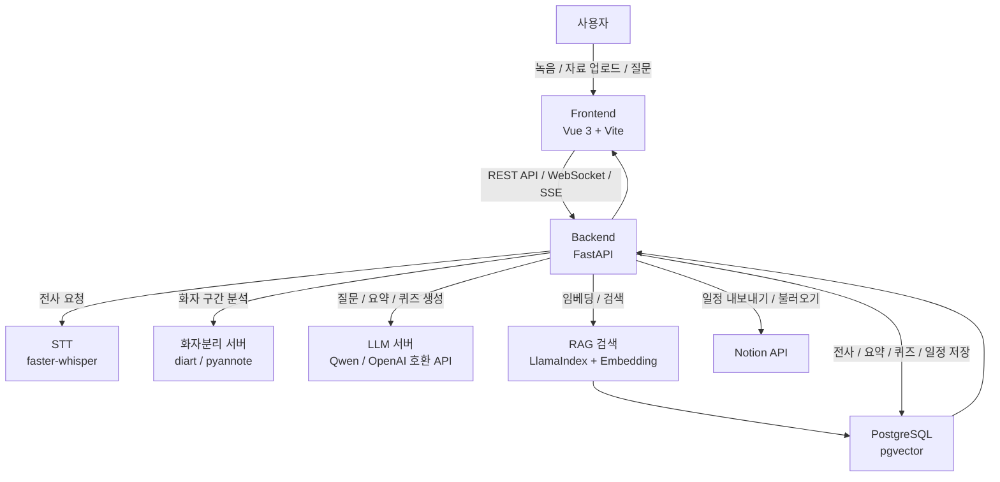
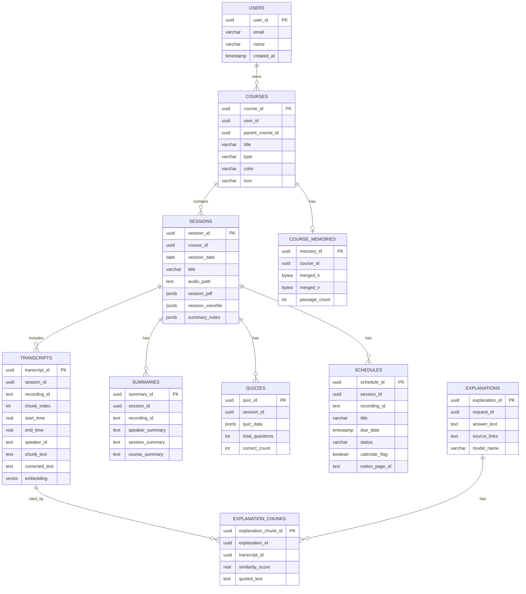

# Bridge AI

  

Bridge AI는 강의, 회의, 발표 음성을 실시간으로 전사하고, 전사문과 업로드 자료를 기반으로 **AI 질문응답, 요약, 퀴즈 생성, 일정 추출**을 제공하는 AI 학습 보조 웹 애플리케이션입니다.  
사용자는 하나의 워크스페이스 안에서 녹음, 자료 업로드, 전사 확인, 근거 기반 AI 채팅, 요약 노트, 퀴즈 풀이, 캘린더 관리를 함께 사용할 수 있습니다.

---

## 팀원

| 이름 | 담당 업무 | 이메일 |
| :---: | :--- | :--- |
| 신창영 | 프론트엔드/백엔드 개발, AI 파이프라인 개발, STT/RAG/요약/퀴즈/일정 기능 개발 | toyoaki900@sunmoon.ac.kr |

---

## 프로젝트 문서 / Notion

더 자세한 설계와 실행 흐름은 아래 문서에서 확인할 수 있습니다.

- [프로젝트 실행 흐름 가이드](docs/project_runtime_guide.md)
- [시스템 모델 문서](docs/system_model.md)
- [LLM 파이프라인 문서](docs/llm_pipeline.md)
- Notion 문서: 추가 예정

---

## 시스템 아키텍처

---

## ERD

---

## Tech Stack

### 백엔드

| 구분 | 기술 | 버전 | 설명 |
| :--- | :--- | :---: | :--- |
| 언어 | Python | - | 백엔드 API, AI 파이프라인, 데이터 처리 구현 |
| 프레임워크 | FastAPI | 0.116.1 | REST API, WebSocket, SSE 스트리밍 서버 구성 |
| 서버 | Uvicorn | 0.35.0 | FastAPI 애플리케이션 실행 |
| 실시간 통신 | WebSocket, SSE | - | 실시간 음성 전사, AI 답변 스트리밍 |
| STT | faster-whisper, openai-whisper | 1.2.0 / 20250625 | 음성 데이터를 텍스트로 변환 |
| 화자분리 | diart, pyannote 기반 서버 | - | 화자별 발화 구간 분석 |
| 한국어 교정 | KoBART 교정 모델 | - | 전사문 맞춤법 및 문맥 보정 |
| AI/RAG | LlamaIndex, Sentence Transformers, Transformers, Torch | - | 자료 검색, 임베딩, LLM 연동 |

### 데이터베이스

| 구분 | 기술 | 버전 | 설명 |
| :--- | :--- | :---: | :--- |
| 데이터베이스 | PostgreSQL | - | 사용자, 과목, 세션, 전사, 요약, 퀴즈, 일정 데이터 저장 |
| 벡터 검색 | pgvector | 0.4.2 | 전사문/자료 임베딩 기반 유사도 검색 |
| DB 드라이버 | asyncpg, psycopg, psycopg2-binary | - | 비동기 DB 연결 및 SQL 실행 |
| ORM/DB 유틸 | SQLAlchemy | 2.0.48 | 데이터 처리 보조 |

### 프론트엔드

| 구분 | 기술 | 버전 | 설명 |
| :--- | :--- | :---: | :--- |
| 프레임워크 | Vue | 3.5.31 | 사용자 화면과 컴포넌트 구성 |
| 빌드 도구 | Vite | 6.0.5 | 개발 서버, 빌드, 프록시 설정 |
| 언어 | JavaScript | - | 화면 상태 관리 및 API 연동 |
| 차트 | Chart.js | 4.5.1 | 분석 결과 시각화 |
| 애니메이션 | Lottie Web | 5.13.0 | UI 애니메이션 렌더링 |
| 문서 처리 | PDF.js, JSZip, Marked | - | PDF/PPT/Markdown 자료 미리보기 및 렌더링 |
| 모바일 확장 | Capacitor | 8.3.1 | iOS 등 네이티브 패키징 확장 기반 |

### 주요 API / 기타 라이브러리

| 구분 | 기술 | 설명 |
| :--- | :--- | :--- |
| LLM API | OpenAI 호환 Chat Completions API | Qwen, Ollama, BridgePRAG 서버 등과 연동 |
| 일정 연동 | Notion API | 추출된 일정을 Notion 데이터베이스와 동기화 |
| 음성 처리 | AudioWorklet, WebSocket | 브라우저 마이크 음성을 실시간 백엔드로 전송 |
| 자료 처리 | PyMuPDF, pytesseract, pypdf | PDF/OCR 기반 강의자료 텍스트 추출 |
| 모델 관리 | Hugging Face, Transformers | STT, 임베딩, LLM, 화자분리 모델 활용 |

---

## 주요 기능

### 1. 실시간 음성 전사

- 브라우저 마이크 음성을 **WebSocket**으로 백엔드에 전송
- **faster-whisper** 기반으로 음성을 실시간 텍스트로 변환
- 전사 chunk를 시간 구간별로 저장하여 이후 검색과 출처 표시에서 활용

### 2. 화자분리 및 전사 보정

- **diart / pyannote** 기반 화자분리 서버와 연동
- STT 결과를 먼저 표시한 뒤, 화자분리 결과가 도착하면 기존 전사 라벨 보정
- **KoBART 교정 모델**을 통해 한국어 전사문 품질 개선

### 3. RAG 기반 AI 채팅

- 사용자의 질문을 바탕으로 전사문과 업로드 자료에서 관련 근거 검색
- **pgvector + 키워드 검색**을 함께 활용하는 하이브리드 검색 구조
- **SSE 스트리밍**으로 AI 답변을 실시간 출력
- 답변 근거가 되는 문장과 시간 정보를 함께 제공

### 4. 강의자료 업로드 및 미리보기

- PDF/PPT 등 학습 자료를 워크스페이스에 업로드
- 자료 텍스트를 추출해 AI 채팅, 요약, 퀴즈 생성 소스로 활용
- 선택한 자료를 화면에서 바로 미리보기 가능

### 5. 자동 요약 및 노트 관리

- 녹음본 또는 강의자료를 기반으로 **세션 요약, 화자별 요약, 과목 요약** 생성
- 요약 결과와 사용자가 작성한 메모를 함께 관리
- 수업 후 복습과 회의록 정리에 활용 가능

### 6. AI 퀴즈 생성 및 채점

- 전사문, 선택한 전사 구간, 강의자료, 직접 입력 텍스트를 기반으로 퀴즈 생성
- **객관식 / OX 문제** 유형 지원
- 사용자 답안 제출 후 자동 채점 및 결과 저장

### 7. 일정 자동 추출 및 캘린더 관리

- 전사문에서 과제, 시험, 발표, 프로젝트 등 일정 후보 자동 추출
- 일정 제목, 마감일, 상태, 출처 문장을 함께 저장
- 캘린더 UI에서 월별 일정 확인 가능
- **Notion API**를 통해 일정 내보내기/불러오기 지원

### 8. 워크스페이스 및 폴더 관리

- 과목/폴더/파일 구조로 학습 자료와 녹음본 정리
- 최근 파일, 즐겨찾기, 파일 트리 기반 탐색 지원
- 삭제 시 전사, RAG, 일정, 요약 데이터까지 함께 정리해 오래된 참조 노출 방지

---

## 시연 영상

시연 영상은 추가 예정입니다.

<!--
이미지를 클릭하면 시연 영상을 확인할 수 있도록 아래 형식으로 추가할 수 있습니다.

-->

---

## 화면 구성

<strong>접속 및 홈</strong>

### Bridge AI 대표 화면

### 홈 대시보드

이미지 추가 예정

<!--  -->

<strong>워크스페이스</strong>

### 실시간 녹음 및 전사 화면

이미지 추가 예정

<!--  -->

### 자료 미리보기 화면

이미지 추가 예정

<!--  -->

### AI 채팅 화면

이미지 추가 예정

<!--  -->

<strong>요약 및 퀴즈</strong>

### 자동 요약 화면

이미지 추가 예정

<!--  -->

### AI 퀴즈 화면

이미지 추가 예정

<!--  -->

<strong>일정 관리</strong>

### 캘린더 화면

이미지 추가 예정

<!--  -->

### Notion 일정 동기화

이미지 추가 예정

<!--  -->

<strong>AI 히스토리 및 파일 관리</strong>

### AI 히스토리 화면

이미지 추가 예정

<!--  -->

### 폴더 / 파일 관리 화면

이미지 추가 예정

<!--  -->

