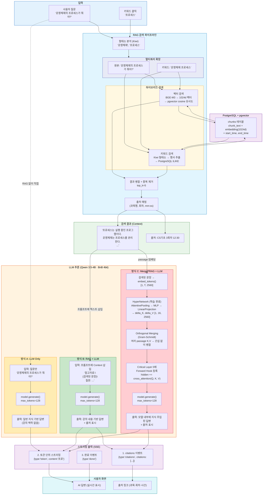

# LLM 추론 파이프라인 상세 모델

> Mermaid Live Editor( https://mermaid.live )에서 렌더링

## 전체 추론 파이프라인 (3가지 방식 비교)



---

## 3가지 방식 비교 요약

| | 방식 A: LLM Only | 방식 B: RAG + LLM | 방식 C: MergePRAG + LLM |
|---|---|---|---|
| **입력** | 질문 텍스트만 | 질문 + 검색된 강의 내용 (텍스트) | 질문 + 검색된 강의 내용 (K,V 벡터) |
| **지식 주입 방식** | 없음 (모델 사전학습 지식만) | 프롬프트에 텍스트 삽입 | Critical Layer에 Cross-Attention Inject |
| **출처 표시** | 불가 | 가능 (mm:ss) | 가능 (mm:ss) |
| **컨텍스트 제한** | 없음 | 토큰 길이 제한에 포함 | K,V 16개로 압축 → 제한 없음 |
| **추론 엔진** | transformers | transformers (또는 vLLM) | transformers only (hook 필요) |
| **속도** | 가장 빠름 | 빠름 | 약간 느림 (HyperNetwork + hook) |

## MergePRAG 상세 흐름

```mermaid
flowchart LR
    subgraph PASSAGE["검색된 강의 문장"]
        P1["'프로세스는 실행 중인 프로그램'"]
        P2["'CPU 스케줄링으로 프로세스 관리'"]
    end

    subgraph EMBED_LAYER["Qwen embed_tokens()"]
        E1["passage 1 → [1, T₁, 2560]"]
        E2["passage 2 → [1, T₂, 2560]"]
    end

    subgraph HYPERNET["HyperNetwork (학습된 가중치)"]
        POOL["AttentivePooling\n[1,T,2560] → [1,2560]"]
        MLP["MLP (2-layer + LayerNorm)\n[1,2560] → [1,2560]"]
        LP["LinearProjection\n[1,2560] → K[1,16,2560], V[1,16,2560]"]
    end

    subgraph ORTHO["Orthogonal Merging"]
        GM["Gram-Schmidt 직교화\npassage 1의 K,V + passage 2의 K,V\n→ 간섭 없이 병합된 K_merged, V_merged"]
    end

    subgraph INJECT["Critical Layer 0 Injection"]
        HOOK["Forward Hook 등록"]
        CROSS["Cross-Attention (8-head)\nQ = hidden_states [1, seq, 2560]\nK = K_merged [1, 16, 2560]\nV = V_merged [1, 16, 2560]"]
        ADD["hidden += cross_attn(Q, K, V)\n(residual addition)"]
    end

    subgraph GENERATE["답변 생성"]
        GEN["model.generate()\nTextIteratorStreamer\n토큰 단위 스트리밍"]
    end

    P1 --> E1
    P2 --> E2
    E1 --> POOL
    E2 --> POOL
    POOL --> MLP --> LP
    LP -->|"K₁,V₁"| GM
    LP -->|"K₂,V₂"| GM
    GM -->|"K_merged, V_merged"| HOOK
    HOOK --> CROSS --> ADD
    ADD --> GEN

    style PASSAGE fill:#E8F5E9,stroke:#2E7D32,color:#000
    style EMBED_LAYER fill:#E3F2FD,stroke:#1565C0,color:#000
    style HYPERNET fill:#FFF3E0,stroke:#E65100,color:#000
    style ORTHO fill:#FCE4EC,stroke:#C62828,color:#000
    style INJECT fill:#F3E5F5,stroke:#6A1B9A,color:#000
    style GENERATE fill:#E0F7FA,stroke:#00838F,color:#000
```



## 입출력 데이터 형식

### API 요청 (Input)
```json
{
  "question": "운영체제의 프로세스가 뭐야?",
  "is_thinking": false
}
```

### API 응답 (Output · SSE 스트리밍)
```
data: {"type":"citations","citations":[{"source":"CS기초 3회차","time":"12:30"}]}

data: {"type":"token","content":"프로"}
data: {"type":"token","content":"세스는"}
data: {"type":"token","content":" 실행 중인"}
data: {"type":"token","content":" 프로그램입니다."}

data: {"type":"done"}
```
