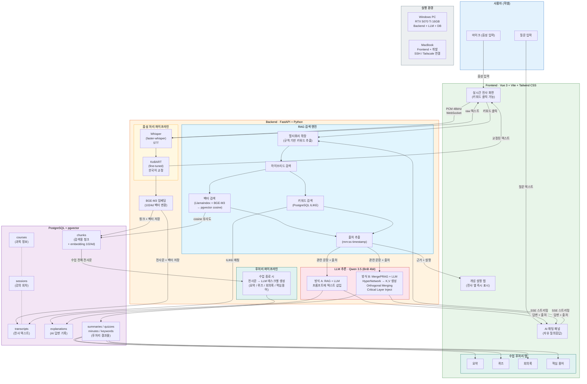

# LectoAI - 시스템 모델 (System Model)

## 주제
**LectoAI: 실시간 강의 보조 AI 시스템**

## 필요성
- 강의 중 놓친 내용을 다시 확인할 수 없음
- 수업 중 모르는 개념을 즉시 질문하기 어려움
- 강의록 정리에 과도한 시간 소요
- 기존 AI 서비스(ChatGPT 등)는 강의 맥락을 모름

## 타당성
- 온디바이스 모델(Whisper, KoBART, Qwen)로 외부 API 없이 운영 → 법적 리스크 없음
- RTX 5070 Ti 16GB 단일 GPU로 전체 파이프라인 구동 가능
- MergePRAG 기술로 RAG 대비 더 정밀한 강의 맥락 주입 가능

## 목적
강의 음성을 실시간 전사하고, 강의 내용 기반으로 학생의 질문에 즉시 답변하는 자체 AI 시스템 구축

---

## 시스템 모델 다이어그램

> Mermaid Live Editor( https://mermaid.live )에 아래 코드를 붙여넣으면 다이어그램이 렌더링됩니다.

---

## 기능 단위 정리

| 기능 | 설명 | 기술 스택 | 데이터 흐름 |
|------|------|-----------|------------|
| **실시간 음성 전사** | 교수 음성을 텍스트로 변환 | Whisper (faster-whisper), WebSocket | 마이크 → Backend → `transcripts` 테이블 |
| **한국어 교정** | 전사 오류 자동 교정 | KoBART (fine-tuned) | `transcripts.original_text` → `transcripts.corrected_text` |
| **강의 내용 임베딩** | 전사문을 벡터로 변환·저장 | BGE-M3 (1024d), pgvector | `transcripts` → `chunks` 테이블 (embedding 컬럼) |
| **하이브리드 검색** | 질문에 관련된 강의 내용 검색 | pgvector (벡터), PostgreSQL (키워드) | 질문 → `chunks` 검색 → 관련 문장 + 출처 |
| **AI 질의응답** | 강의 맥락 기반 답변 생성 | Qwen 3.5 (BnB 4bit), SSE 스트리밍 | 검색 결과 + 질문 → LLM → 스트리밍 답변 |
| **MergePRAG 주입** | 강의 내용을 모델 내부에 직접 주입 | HyperNetwork, Cross-Attention, Orthogonal Merge | 검색 결과 → K,V 생성 → Critical Layer Inject |
| **과목별 메모리 관리** | 과목마다 독립된 지식 메모리 유지 | Orthogonal Merging (Gram-Schmidt) | `courses` 테이블 기준 메모리 분리 |
| **출처 표시** | 답변의 근거가 되는 강의 시점 표시 | Citation 추출, timestamp 매핑 | `chunks.start_time/end_time` → "mm:ss" 형식 |

---

## 기술 스택 요약

| 계층 | 기술 | 역할 |
|------|------|------|
| **Frontend** | Vue 3, Vite, Tailwind CSS | UI, 실시간 표시, 채팅 인터페이스 |
| **Backend** | FastAPI, Python, asyncio | API 서버, 음성 처리, RAG 검색 |
| **STT** | faster-whisper (large-v3-turbo) | 음성 → 텍스트 변환 |
| **교정** | KoBART (fine-tuned) | 한국어 전사 오류 교정 |
| **임베딩** | BAAI/bge-m3 (1024d) | 텍스트 → 벡터 변환 |
| **DB** | PostgreSQL + pgvector | 데이터 저장 + 벡터 검색 |
| **LLM** | Qwen 3.5 (BitsAndBytes 4bit) | 답변 생성 |
| **MergePRAG** | HyperNetwork + Cross-Attention | 지식 주입 (논문 기반) |
| **통신** | WebSocket, SSE | 실시간 양방향/단방향 스트리밍 |

---

## 실행 환경

| 장비 | 역할 | 사양 |
|------|------|------|
| **Windows PC** | Backend + LLM + DB | RTX 5070 Ti 16GB, CUDA |
| **MacBook** | Frontend + 개발 | SSH/Tailscale로 Windows 연결 |

모든 모델은 자체 서버에서 구동 (외부 API 의존 없음)
